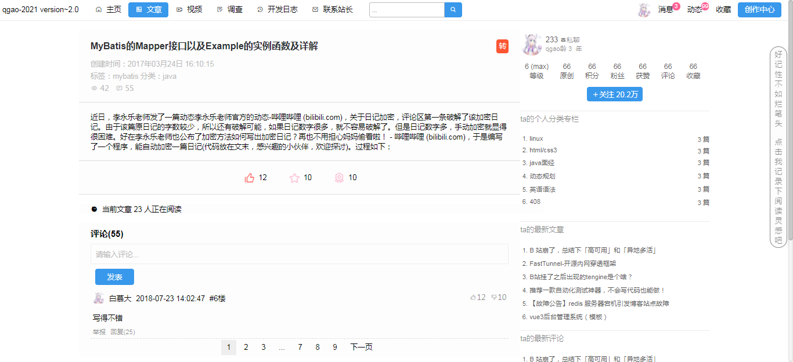

<!-- START doctoc generated TOC please keep comment here to allow auto update -->
<!-- DON'T EDIT THIS SECTION, INSTEAD RE-RUN doctoc TO UPDATE -->
<!-- **Table of Contents**  *generated with [DocToc](https://github.com/thlorenz/doctoc)* -->

- [qgaoWebPage](#qgaowebpage)
- [介绍](#介绍)
  - [文章](#文章)
  - [调查](#调查)
  - [用户](#用户)
  - [其它](#其它)
- [未完成](#未完成)

<!-- END doctoc generated TOC please keep comment here to allow auto update -->

# qgaoWebPage

这是点子的前端代码。

可以通过：https://qgao233.github.io/qgaoWebPage/html/article/articleHome.html 进行查看

# 介绍

v2.0

## 文章

* 文章列表

* 查看文章

* 创建文章

## 调查

* 创建调查

* 填写调查

## 用户

* 注册

* 登录

* 用户主页

* 修改信息

## 其它

* 主页

* 开发日志

* 联系站长

* 搜索

# 未完成

有点多，慢慢来